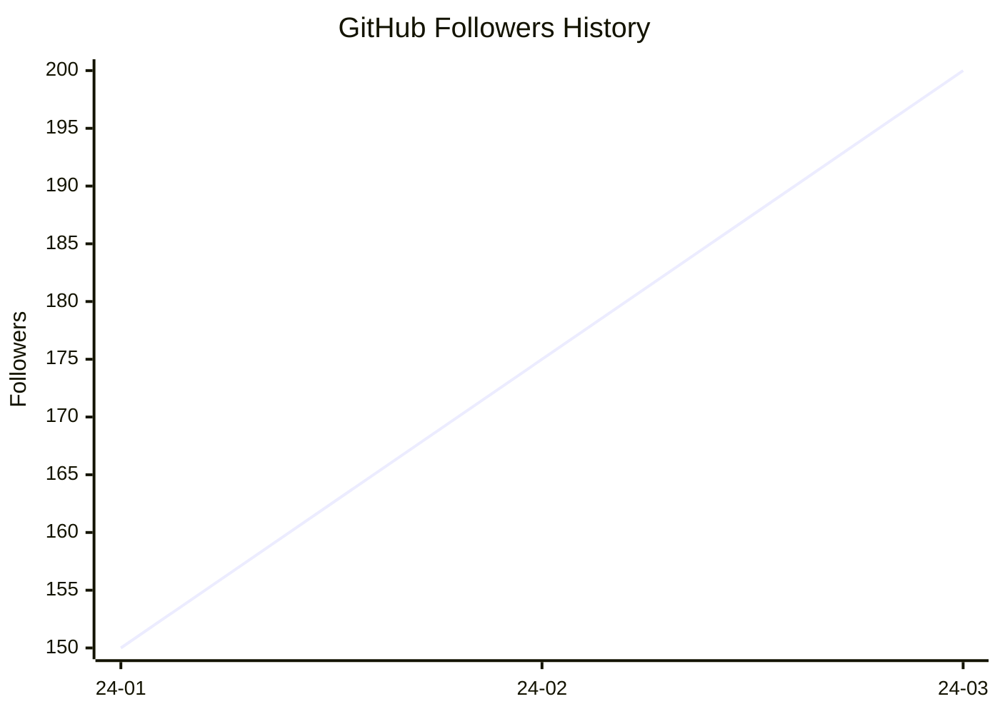

# GitHub Follower History

Track GitHub follower count history from [top-github-users](https://github.com/gayanvoice/top-github-users)
and generate Mermaid charts.

## Features

- Fetch historical follower data from top-github-users repository
- Generate CSV data with timestamps
- Create Mermaid charts for visualization on GitHub
- Filter by date range
- Customize x-axis label density
- Available as GitHub Actions composite action

## Usage

### GitHub Actions

Create a workflow file (e.g., `.github/workflows/update-follower-history.yml`):

```yaml
name: Update Follower History

on:
  schedule:
    - cron: "0 0 1 * *" # Monthly on the 1st at midnight
  workflow_dispatch: # Allow manual trigger

jobs:
  update:
    runs-on: ubuntu-latest
    steps:
      - name: Checkout repository
        uses: actions/checkout@v4

      - name: Generate Follower History
        uses: ./
        with:
          country: japan
          username: yutkat
          output-csv: /tmp/follower_history.csv
          target-file: README.md
          start-date: 2023-06-17
          max-labels: 15

      - name: Commit and Push
        run: |
          git config user.name "github-actions[bot]"
          git config user.email "github-actions[bot]@users.noreply.github.com"
          git add README.md
          git commit -m "Update follower history [skip ci]" || exit 0
          git push
```

#### Action Inputs

| Input         | Required | Default                | Description                                                                          |
| ------------- | -------- | ---------------------- | ------------------------------------------------------------------------------------ |
| `country`     | Yes      | -                      | Country name (e.g., japan, china, usa)                                               |
| `username`    | Yes      | -                      | GitHub username to track                                                             |
| `output-csv`  | No       | `follower_history.csv` | Output CSV filename                                                                  |
| `target-file` | Yes      | -                      | Target markdown file (inserts between START_SECTION and END_SECTION comment markers) |
| `start-date`  | No       | `""` (all data)        | Start date for chart (YYYY-MM-DD format)                                             |
| `max-labels`  | No       | `""` (no thinning)     | Maximum number of x-axis labels                                                      |

#### How It Works

The action inserts the generated Mermaid chart between special comment markers in your target markdown file.

**Example target file (README.md):**

```markdown
# My Profile

## Follower History

<!--START_SECTION:github_follower_history-->
<!--END_SECTION:github_follower_history-->

## Other Content
```

After the action runs, it will be:

```markdown
# My Profile

## Follower History

<!--START_SECTION:github_follower_history-->

\`\`\`mermaid
xychart-beta
title "GitHub Followers History"
x-axis ["24-01","24-02","24-03"]
y-axis "Followers"
line [150,175,200]
\`\`\`

<!--END_SECTION:github_follower_history-->

## Other Content
```

## Output Format

### CSV Output

```csv
date,followers
2024-01-15 12:00:00 +0000,150
2024-02-20 12:00:00 +0000,175
```

### Mermaid Chart

The generated chart uses GitHub's Mermaid support:


